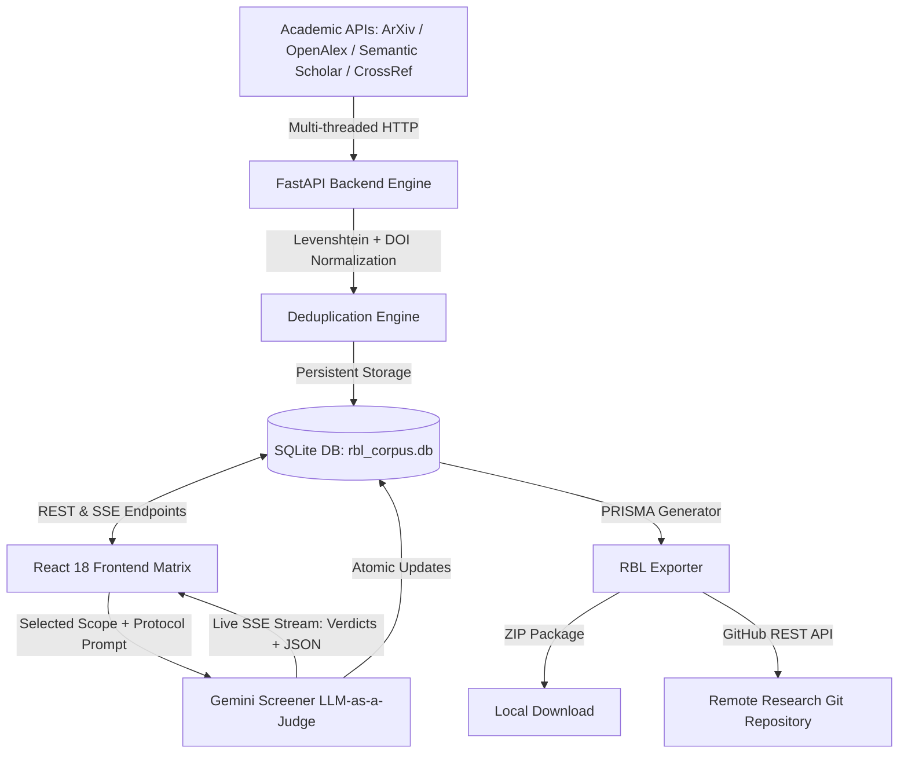

# 🔬 RBL Research Intelligence Tool (`rbl-research-tool`)

> **Next-Generation Systematic Literature Review (SLR) & Academic Intelligence Platform**  
> *Compliant with PRISMA 2020 Guidelines • Powered by Gemini 2.5/3.0 LLM-as-a-Judge • Zero Data Fabrication Policy*

---

## 📑 Table of Contents
1. [Overview & Research Philosophy](#-overview--research-philosophy)
2. [Key Architecture & Features](#-key-architecture--features)
3. [Quick Start & Installation](#-quick-start--installation)
4. [Step-by-Step User Guide](#-step-by-step-user-guide)
   - [1. Research Protocol Configuration (PICO + IC/EC)](#1-research-protocol-configuration-pico--icec)
   - [2. Multi-Source Academic Harvesting](#2-multi-source-academic-harvesting)
   - [3. Deduplication & Corpus Sanitization](#3-deduplication--corpus-sanitization)
   - [4. AI Auto-Screening & Multi-Scope Engine](#4-ai-auto-screening--multi-scope-engine)
   - [5. 7-Column Grounded Evidence Extraction](#5-7-column-grounded-evidence-extraction)
   - [6. PRISMA Export & Atomic GitHub Commit](#6-prisma-export--atomic-github-commit)
5. [System Architecture](#-system-architecture)
6. [Project Directory Structure](#-project-directory-structure)
7. [Tech Stack](#-tech-stack)
8. [Research Compliance & Ethics](#-research-compliance--ethics)

---

## 🌟 Overview & Research Philosophy

Conducting a **Systematic Literature Review (SLR)** requires processing hundreds of academic publications across disparate databases, screening them against strict eligibility criteria, and extracting grounded empirical metrics without hallucination.

**RBL Research Tool** is an end-to-end academic workspace engineered for research teams and capstone projects. It combines **multi-threaded academic API crawlers**, an **intelligent deduplication engine**, a **4-tier editorial table UI**, and a **transparent Gemini LLM-as-a-Judge screening pipeline** to accelerate systematic reviews from weeks to hours while maintaining 100% scientific integrity.

### 🛡️ Zero Data Fabrication Guarantee:
- Every paper status transition, exclusion code, and AI rationale is persisted in an atomic SQLite database.
- AI screening outputs include full peer-review justifications, exact matched criteria codes (`IC1–IC5`, `EC1–EC5`), confidence ratings, and raw JSON observability traces.

---

## 🚀 Key Architecture & Features

### 1. 🌐 Live Multi-Source Academic Harvesting
- Crawls **ArXiv, OpenAlex, Semantic Scholar, CrossRef, and Google Scholar** in parallel threads.
- Server-Sent Events (**SSE**) stream live harvest progress, per-source response times, and yield counts in real time.
- Automated pagination and rate-limiting backpressure.

### 2. 🧬 Real-Time Deduplication Engine
- **Multi-layer matching**: Normalized DOI matching, canonical URL comparison, and fuzzy string distance (Levenshtein ratio $\ge 0.88$).
- Automated duplicate flagging with one-click side-by-side comparison and atomic merging.

### 3. 📊 4-Tier High-Clarity Editorial Metadata Matrix
- **Tier 1 (Anchor)**: Prominent Plus Jakarta Sans bold title with direct publication links.
- **Tier 2 (Attribution)**: Clean, truncated author attribution with group icons.
- **Tier 3 (Context)**: Standardized, color-coded metadata pills (Year, Venue, Academic Source badge, Click-to-copy DOI, Citation counts, Matrix Extracted badge).
- **Tier 4 (Abstract)**: Prominent `[ 👁️ Read Abstract ]` action button opening an editorial reader modal with full publication context.

### 4. 🤖 Gemini LLM-as-a-Judge Auto-Screener
- Powered by **Google Gemini 2.5 Flash / 3.0 Flash / Pro** with automatic API discovery.
- **4-Tier Contextual Screening Scopes**:
  1. `Selected (Ticked) Only`: Screen only papers checked via table checkboxes (Default when active).
  2. `Current Tab View`: Screen all papers in the active tab/search filter.
  3. `Pending / Unreviewed`: Screen only un-evaluated papers.
  4. `All Corpus Records`: Full corpus re-evaluation against new protocol criteria.
- **Real-Time Observability Console**: Live SSE evaluation stream, live token cost metrics, filter pills (`INCLUDED`, `EXCLUDED`, `UNSURE`), peer-review scientific justification box, and expandable raw JSON inspector.
- **Persistent Floating Mini-Dock**: Minimizing the modal preserves active screening in a compact, pulsating dock without losing progress.

### 5. 📑 7-Column Evidence Matrix & PRISMA Exporter
- Structured data extraction modal for included papers:
  1. `Paper Title & Canonical URL`
  2. `Tool / Model Evaluated` (e.g. PhoBERT, GPT-4o-mini)
  3. `Dataset Name & Domain`
  4. `Sample Size (N)`
  5. `Metrics Evaluated` (Accuracy, Precision, Recall, Macro-F1, Latency)
  6. `Empirical Results & Findings`
  7. `Limitations & Threats to Validity`
- Generates a full PRISMA 2020 artifact package:
  - `01_all_records.csv`: Full harvested raw corpus.
  - `02_after_screening_v1.csv`: Corpus post-screening with exclusion codes.
  - `03_final_included.csv`: Final included evidence table.
  - `evidence-table.md`: GitHub-flavored markdown evidence synthesis.
  - `search-log.md`: Detailed query, date, and source provenance log.
  - `gap-analysis.md`: Empirical research gap analysis.

### 6. 🐙 Direct GitHub Atomic Committer
- Commits the entire SLR artifact package directly to your team's GitHub repository via the GitHub REST API without requiring a local Git CLI.

---

## ⚡ Quick Start & Installation

### Option A: Standalone Executable (No Setup Required)

1. Double-click **[`start_app.bat`](./start_app.bat)** or run the precompiled binary:
   ```bash
   dist/RBL_Research_Tool.exe
   ```
2. The application automatically starts the FastAPI backend, opens your default browser at `http://localhost:5173/`, and connects to the local SQLite database.

---

### Option B: Developer Setup (From Source)

#### Prerequisites:
- **Node.js** (v18+ recommended)
- **Python** (v3.10+ recommended)

#### 1. Clone the repository:
```bash
git clone https://github.com/thalord2825/RBL_tool.git
cd RBL_tool
```

#### 2. Backend Setup:
```bash
cd backend
python -m venv venv
# Windows:
.\venv\Scripts\activate
# Linux/macOS:
source venv/bin/activate

pip install -r requirements.txt
python run.py
```
*Backend server runs at `http://localhost:8000` (API documentation at `http://localhost:8000/docs`).*

#### 3. Frontend Setup:
```bash
# In the root directory:
npm install
npm run dev
```
*Frontend dev server runs at `http://localhost:5173`.*

---

## 📖 Step-by-Step User Guide

### 1. Research Protocol Configuration (PICO + IC/EC)
1. Click the **"Protocol (5 IC / 5 EC)"** button in the top navigation bar.
2. Define your **PICO framework**:
   - **P (Population/Problem)**: Target domain and input types.
   - **I (Intervention/Technique)**: AI/ML architectures and prompt strategies.
   - **C (Comparison/Baselines)**: Benchmark models or traditional baselines.
   - **O (Outcome/Target Metrics)**: Macro-F1, Precision, Latency, Token Cost.
3. Review and customize the **5 Inclusion Criteria (IC1–IC5)** and **5 Exclusion Criteria (EC1–EC5)**.
4. Click **"Save Research Protocol"** — changes are instantly saved to the SQLite database.

---

### 2. Multi-Source Academic Harvesting
1. Enter your search query in the search bar (e.g., `"Vietnamese scam message classification LLM few-shot"`).
2. Toggle the desired academic databases: `ArXiv`, `OpenAlex`, `Semantic Scholar`, `CrossRef`, `Google Scholar`.
3. Set the publication start year (e.g., `2020`).
4. Click **"Harvest Metadata"**.
5. Watch the live **Server-Sent Events (SSE)** harvest console stream papers in real time with duplicate detection.

---

### 3. Deduplication & Corpus Sanitization
1. Switch to the **"DUPLICATES"** tab on the evidence table to view flagged papers.
2. Click **"Duplicate with [PXXX]"** on any flagged paper to open the **Side-by-Side Comparison Inspector**.
3. Choose to either **"Merge & Retain Record"** (merges missing metadata and deletes the duplicate) or **"Dismiss Duplicate Flag"**.

---

### 4. AI Auto-Screening & Multi-Scope Engine
1. Click **"AI Auto-Screen"** on the header or the **Floating Action Dock**.
2. Enter your **Google Gemini API Key** (saved securely in local browser storage).
3. Select an AI Model (e.g., `Gemini 2.5 Flash`).
4. Choose your **Screening Scope**:
   - **Selected (Ticked) Only**: Evaluates only the papers currently checked in the table.
   - **Current Tab View**: Evaluates all papers visible in the current filter or search query.
   - **Pending / Unreviewed**: Evaluates only unreviewed records.
   - **All Corpus Records**: Evaluates the full database.
5. Click **"Run AI Screening"**.
6. The real-time evaluation modal streams live justifications, matched criteria codes, and confidence ratings per paper.
7. You can click **Minimize (—)** to collapse the console into a floating background mini-dock and continue working while Gemini screens.

---

### 5. 7-Column Grounded Evidence Extraction
1. On any paper marked **`INCLUDED`**, click the **"+ Extract Evidence"** button.
2. Fill in the empirical fields:
   - Evaluated Model / Architecture.
   - Dataset Name & Domain.
   - Sample Size ($N$).
   - Metrics Evaluated & Empirical Results ($F1$, Precision, Latency).
   - Limitations & Validity Threats.
3. Click **"Save Extraction Data"** to store the grounded matrix.

---

### 6. PRISMA Export & Atomic GitHub Commit
1. Click **"Export SLR"** in the top navigation bar.
2. Review the **PRISMA 2020 Flow Diagram metrics** (Total Identified, Duplicates Removed, Screened, Excluded by EC code, Final Included).
3. **Export Options**:
   - **Download PRISMA Package (.ZIP)**: Downloads all 6 CSV and Markdown files locally.
   - **Direct Git Commit**: Enter your GitHub Token, Repository Name (`owner/repo`), and Branch. Click **"Commit to GitHub"** to push all SLR artifacts directly into your research repository.

---

## 🏗️ System Architecture



---

## 📁 Project Directory Structure

```
rbl-research-tool/
├── backend/
│   ├── app/
│   │   ├── crawlers/             # Academic API crawlers (ArXiv, OpenAlex, etc.)
│   │   ├── database.py           # SQLite connection & atomic transaction engine
│   │   ├── deduplication.py      # Fuzzy & DOI duplicate detection
│   │   ├── exporter.py           # PRISMA 2020 artifact package generator
│   │   ├── gemini_screener.py    # LLM-as-a-Judge evaluation engine
│   │   ├── github_committer.py   # GitHub REST API direct committer
│   │   ├── main.py               # FastAPI application & SSE streaming endpoints
│   │   └── schemas.py            # Pydantic request/response data models
│   ├── rbl_corpus.db             # Persistent SQLite database
│   ├── requirements.txt          # Python dependencies
│   └── run.py                    # Backend server entry point
├── src/
│   ├── components/
│   │   ├── AiRationaleModal.jsx       # AI decision & rationale inspector
│   │   ├── AiScreenMiniDock.jsx       # Minimized background screening capsule
│   │   ├── AiScreenModal.jsx          # 4-tier screening scope configuration
│   │   ├── AiScreenProgressModal.jsx  # Real-time Light Academic screening console
│   │   ├── DuplicateCompareModal.jsx  # Side-by-side duplicate merging tool
│   │   ├── ErrorBoundary.jsx          # Global React exception boundary
│   │   ├── EvidenceExtractionModal.jsx# 7-column empirical matrix extractor
│   │   ├── EvidenceTable.jsx          # 4-tier editorial academic evidence table
│   │   ├── ExclusionReasonModal.jsx   # Mandatory EC exclusion reason picker
│   │   ├── ExportModal.jsx            # PRISMA metrics & Git commit modal
│   │   ├── HarvestProgressModal.jsx   # Real-time multi-source crawler stream
│   │   ├── ProtocolSettingsModal.jsx  # PICO & 5 IC / 5 EC protocol manager
│   │   ├── SearchQueryBar.jsx         # Query bar & source selection toggles
│   │   └── TopHeader.jsx              # System statistics & navigation bar
│   ├── services/
│   │   └── apiClient.js          # REST & SSE client communication layer
│   ├── App.jsx                   # Main application orchestration & state
│   ├── index.css                 # Custom academic typography & Tailwind styles
│   └── main.jsx                  # React application root
├── dist/
│   └── RBL_Research_Tool.exe     # Standalone 1-click Windows executable
├── launcher.py                   # Embedded multi-process launcher for PyInstaller
├── start_app.bat                 # Windows quick-start script
├── shutdown_all.bat              # Safe port & background server terminator
├── tailwind.config.js            # Warm editorial academic design tokens
└── package.json                  # Node.js dependencies & scripts
```

---

## 🛠️ Tech Stack

| Layer | Technology | Purpose |
| :--- | :--- | :--- |
| **Frontend Framework** | React 18 + Vite | High-performance reactive UI |
| **Styling & Theme** | TailwindCSS + Lucide Icons | Warm Light Academic Editorial Design System |
| **Backend Framework** | FastAPI (Python 3.10+) | High-throughput asynchronous REST & SSE server |
| **AI Screening Engine** | Google Gemini 2.5/3.0 Flash/Pro | Zero-fabrication LLM-as-a-Judge evaluation |
| **Corpus Database** | SQLite3 | Local atomic ACID transactions & persistent storage |
| **Desktop Packaging** | PyInstaller | Portable standalone executable distribution |

---

## ⚖️ Research Compliance & Ethics

This tool is built in strict adherence to:
1. **PRISMA 2020 Statement**: Preferred Reporting Items for Systematic Reviews and Meta-Analyses.
2. **Zero Data Fabrication Policy**: Complete traceability of search queries, raw abstracts, and evaluation justifications.
3. **Reproducibility**: Protocol definitions and search logs are exportable as deterministic artifacts.

---

*Authored and Maintained for the **RBL ScamShield Research Intelligence Group**.*
